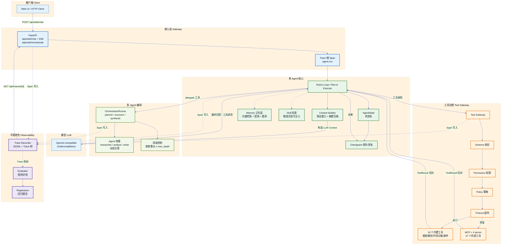

# ReAgent

> **Re**Act · **Re**ason · **Re**try —— 从零实现的 LLM Agent 运行时（Python 3.11+）。

**不使用任何 Agent Framework**（LangGraph / CrewAI / AutoGen）：ReAct 循环、
上下文构建、会话与检查点、Redis 队列、工具网关与策略、记忆检索、MCP 接入、
Skill 技能、多 Agent 编排 —— 全部自己实现。

```text
Stage 1   Agent 怎么执行？          → ReAct / Tool Loop
Stage 2   模型实际看到什么？         → Context Builder
Stage 3   执行状态如何保存恢复？     → Session / Checkpoint
Stage 4   并发请求怎么处理？         → Redis Queue / Worker
Stage 5   Tool 怎么统一治理？        → Tool Gateway / Policy
Stage 6   为什么失败、修改是否变好？ → Tracing / Evaluation
Stage 8   长期记忆怎么存怎么取？     → Memory（向量检索 + 提炼 + 重排）
Stage 9   复杂任务怎么拆解执行？     → Plan & Execute + 反思
Stage 10  怎么接入真实世界？         → 真实工具 + MCP
Stage 11  怎么复用专家能力？         → Skill 系统
Stage 12  一个 agent 怎么组织多个？  → 多 Agent 编排（Manager/Worker）
```

---

## Demo（30 秒建立印象）

> 📹 演示视频 / GIF 占位：多 Agent 编排「调研 + 分析 + 成稿」任务的
> Trace 树完整嵌套可视化（orchestrator → 子 agent → 工具调用）。
> 录制方法见 [docs/demo-guide.md](docs/demo-guide.md)。

```
┌─ 主 Agent ─────────────────────────────────────────────┐
│ delegate(task="调研2024大模型进展并给出RAG建议",        │
│          agents=[researcher, analyst, writer])         │
└──────────────────────────┬─────────────────────────────┘
                           ▼
┌─ OrchestratorRunner ───────────────────────────────────┐
│ planner: LLM 分工 → researcher→analyst→writer 依赖链   │
│ execute: 依赖图逐轮推进，并行组限流                    │
│ synthesize: 主管 LLM 整合各子 agent 结果               │
└──────────────────────────┬─────────────────────────────┘
                           ▼
  Trace 树: orchestrator.run → agent.run ×3 → llm_call / tool.execute
```

## 快速开始

```bash
# 1) 安装依赖
pip install -r requirements.txt

# 2) （可选）配置真实 LLM；不配置则用内置 Stub 模型（离线可跑）
cp .env.example .env   # 填写 LLM_BASE_URL / LLM_API_KEY / LLM_MODEL

# 3) 逐阶段 Demo（离线可跑）
python -m demos.stage1_demo   # ReAct / Tool Loop
python -m demos.stage2_demo   # Context Builder
python -m demos.stage3_demo   # Session + Checkpoint 断点恢复
python -m demos.stage5_demo   # Tool Gateway / Policy

# 4) 队列 Demo（需要 Redis：docker compose up -d redis）
python -m demos.stage4_demo   # 10 请求 / 3 Worker / 重试
python -m demos.stage6_demo   # 完整 Trace 树 + 超时 ERROR

# 5) 测试（240 个，全部离线可跑）
pytest

# 6) 评测与回归
python -m evals.runner
python -m evals.runner --compare evals/runs/<baseline>.json

# 7) Docker 全链路
docker compose up --build
docker compose up --scale worker=3   # 扩容 Worker

# 8) Web UI（进程内直连，无需 Redis/Worker）
python -m uvicorn app.main:app --port 8000
# 浏览器打开 http://localhost:8000/ 使用聊天界面
```

## 架构图



> 图例：接入层（蓝）→ Agent 核心（绿）→ 多 Agent 编排（浅绿）→
> 工具治理（橙）→ 可观测性（紫）。

## 能力总览

| 能力 | 说明 | 规模 |
|---|---|---|
| 执行模式 | ReAct 循环 + Plan-and-Execute + 反思重规划 | 2 种模式 |
| 上下文管理 | 滑动窗口 + 摘要压缩 + 窗口边界协议修复 | 12+ 场景测试 |
| 状态恢复 | Session / Checkpoint 版本化断点恢复 | 崩溃不重放 |
| 工具治理 | 校验 → 权限 → 策略 → 超时 → 统一信封 | 16 内置 + 47 MCP |
| 记忆层 | 向量检索 + 事实提炼 + 重排，失败自动降级 | 3 策略可切换 |
| MCP 协议 | filesystem / fetch / think / github | 4 server |
| Skill 系统 | 触发词匹配 + 指令注入 | 2+ 技能 |
| 多 Agent 编排 | LLM 分工、依赖图并行、嵌套委派、动态档案、结果持久化 | 深度可控 |
| 可观测性 | JSONL Span + Trace 树 + Web UI 可视化 | 全链路 |
| 测试 | pytest 全部离线可跑 | 240 passed |

## 阶段演进与文档

| 阶段 | 解决什么问题 | 核心组件 | 文档 |
|---|---|---|---|
| 1 ReAct / Tool Loop | Agent 怎么执行 | `react_loop.py` `runtime.py` `client.py` | [docs/stage1.md](docs/stage1.md) |
| 2 Context Builder | 模型实际看到什么 | `context_builder.py` | [docs/stage2.md](docs/stage2.md) |
| 3 Session / Checkpoint | 状态怎么保存恢复 | `session/` `checkpoint/` `state.py` | [docs/stage3.md](docs/stage3.md) |
| 4 Redis Queue / Worker | 并发怎么处理 | `queue/` `worker/` `api/` | [docs/stage4.md](docs/stage4.md) |
| 5 Tool Gateway / Policy | 工具怎么治理 | `gateway.py` `policy.py` | [docs/stage5.md](docs/stage5.md) |
| 6 Tracing / Evaluation | 失败怎么查、改没改好 | `tracing/` `evals/` | [docs/stage6.md](docs/stage6.md) |
| 8 Memory | 长期记忆怎么存怎么取 | `memory/` | docs/stage8（demo） |
| 9 Planning | 复杂任务怎么拆解 | `planner.py` `plan_loop.py` | docs/stage9（demo） |
| 10 MCP + 真实工具 | 怎么接入真实世界 | `mcp/` `tools/builtin/` | docs/stage10（demo） |
| 11 Skill | 怎么复用专家能力 | `skills/` | docs/stage11（demo） |
| 12 多 Agent 编排 | 一个 agent 怎么组织多个 | `orchestrator/` | [docs/stage12.md](docs/stage12.md) |

## 面试准备

- **[docs/interview.md](docs/interview.md)** —— 10 个高频追问与参考答案
  （为什么不用框架 / 滑动窗口 vs 摘要 / MCP stdio vs SSE / 并行隔离 /
  深度防递归 / 记忆降级 / 沙箱安全 / 消息协议 400 / 断点恢复语义 / 测试组织）

## 目录结构

```text
reagent/
├── app/
│   ├── api/routes.py        HTTP Gateway（chat / jobs / traces）
│   ├── api/web.py           Web UI 路由（进程内直连 + SSE 流式 + 编排）
│   ├── agent/               ReAct 循环 / 规划 / 运行时 / 上下文构建 / 状态
│   ├── orchestrator/        多 Agent 编排（planner / executor / runner / 档案 / 持久化）
│   ├── llm/client.py        统一 LLM Client（OpenAI-compatible + Stub）
│   ├── memory/              记忆层（Embedding / 检索 / 重排 / 提炼）
│   ├── mcp/                 MCP 接入（client / bridge）
│   ├── skills/              技能系统（loader / manager）
│   ├── session/             SQLite 会话持久化
│   ├── checkpoint/          SQLite 检查点（版本递增 / 断点恢复）
│   ├── queue/               Redis List 自研队列（幂等 / 重试）
│   ├── worker/              独立 Worker 进程
│   ├── tools/               注册表 / Gateway / Policy / 内置工具
│   ├── tracing/             Span / ContextVar / Recorder / trace_span
│   ├── static/              Web UI 前端（HTML/CSS/JS）
│   └── main.py              FastAPI 入口
├── skills/                  可加载技能（SKILL.md 格式）
├── evals/                   数据集 / 评测器 / Runner / 回归报告
├── demos/                   每阶段可运行 Demo
├── docs/                    每阶段文档 + 面试指南
├── tests/                   pytest（240）
├── traces/                  Trace JSONL
├── docker-compose.yml       api / redis / worker
├── Dockerfile
├── .env.example
└── requirements.txt
```

## 配置（全部环境变量注入）

```env
LLM_BASE_URL=            # OpenAI-compatible 接口地址
LLM_API_KEY=             # API Key
LLM_MODEL=               # 模型名
REDIS_URL=               # Redis 地址
DATABASE_URL=            # SQLite 地址
MAX_CONTEXT_MESSAGES=    # Context 滑动窗口
MAX_AGENT_STEPS=         # ReAct 最大步数
ORCHESTRATOR_MAX_DEPTH=  # 多 Agent 编排最大深度（默认 2）
AGENT_PROFILES_FILE=     # 动态注册档案持久化文件
TRACE_ENABLED=           # 是否开启 Tracing
TRACE_FILE=              # Trace 落盘路径
```

完整清单见 [.env.example](.env.example)。

## 测试

```bash
pytest        # 240 passed（全部离线，无外部依赖）
```

覆盖：ReAct loop / 上下文窗口 / 压缩 / 会话持久化 / 检查点断点恢复 / 队列重试 /
工具网关（校验/权限/策略/超时）/ Trace 嵌套与传播 / Eval / 记忆检索 / 规划反思 /
MCP bridge / 文档工具 / 多 Agent 编排（并行/依赖/嵌套/深度限制/持久化）。

## 安全设计

- 禁止 `eval()` / `exec()` / `shell=True`；计算器用 `ast` 白名单手工求值；
  `run_code` 沙箱同样基于 AST 白名单 + 模块拦截；
- Trace 默认不保存 API Key / Authorization / Cookie / Password / Token（redact + 内容省略）；
- 子 Agent 能力边界由档案工具白名单物理限定；编排深度有上限防递归；
- 所有密钥与地址走环境变量，代码零硬编码。

## 学习清单（读完代码后应能回答）

Agent Tool Loop 为什么需要循环？Tool Result 为什么要重新进入 Messages？
Session History 和 LLM Context 为什么不是一个东西？Context Builder 在每轮 Tool Call 后是否重新运行？
Checkpoint 保存的是什么？和数据库 Session 有什么区别？为什么 Redis Queue 能提升并发？
Gateway 和 Worker 为什么应该拆开？什么是幂等？Retry 为什么可能导致 Tool 重复执行？
Schema Validation 应该在哪一层？Permission 和 Policy 有什么区别？Tool Timeout 谁负责？
Trace 和 Log 有什么区别？Trace ID / Span ID / Parent Span ID 是什么？为什么跨 Redis 后 Trace 会断？
ContextVar 为什么比手动传参好？`with trace_span(...)` / `@contextmanager` / `yield` / token / reset 怎么工作？
为什么 Agent Evaluation 不能只看最终答案？Outcome 与 Trajectory 评测的区别？
P95 Latency 是什么？为什么修改 Prompt 后必须做 Regression Evaluation？
多 Agent 编排的深度上限怎么防递归？并行子 agent 的上下文为什么不会互相污染？

每个问题的答案都藏在对应阶段的真实代码里（见 [docs/](docs/) 各阶段文档）。
