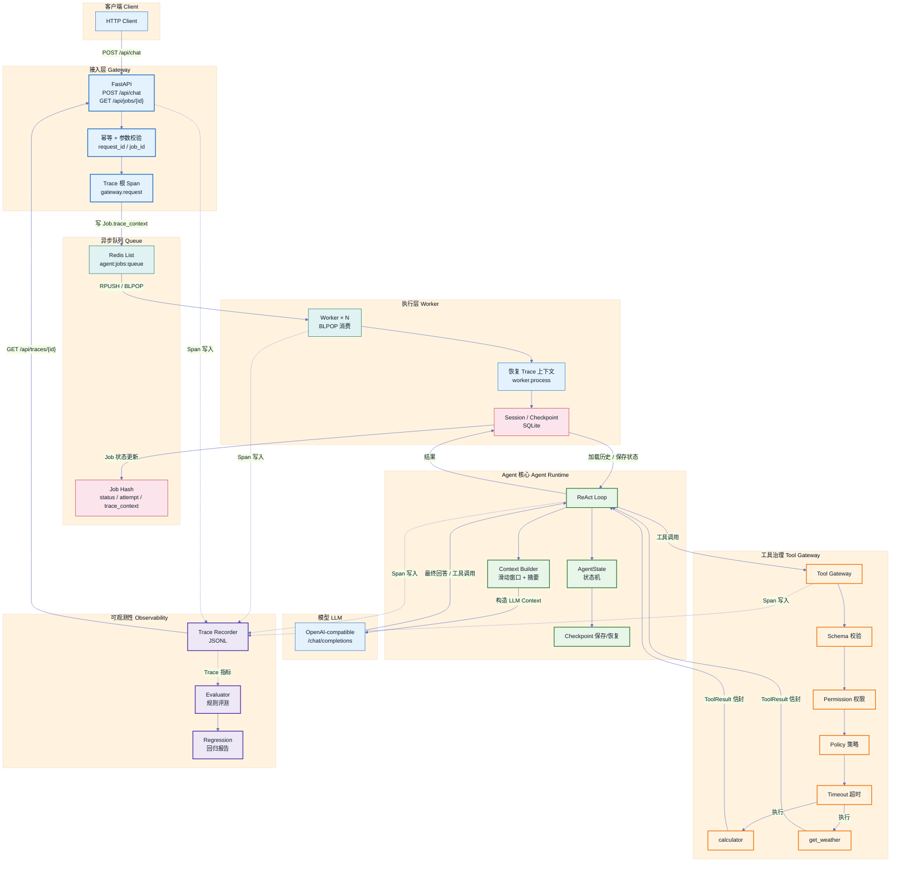

# agent-runtime

从零实现的教学型 Agent Runtime（Python 3.11+）。

**不使用任何 Agent Framework**（LangGraph / CrewAI / AutoGen），
底层机制 —— ReAct 循环、上下文构建、会话与检查点、Redis 队列、
工具网关与策略、链路追踪与评测 —— 全部自己实现。

```text
Stage 1  Agent 怎么执行？          → ReAct / Tool Loop
Stage 2  模型实际看到什么？         → Context Builder
Stage 3  执行状态如何保存恢复？     → Session / Checkpoint
Stage 4  并发请求怎么处理？         → Redis Queue / Worker
Stage 5  Tool 怎么统一治理？        → Tool Gateway / Policy
Stage 6  为什么失败、修改是否变好？ → Tracing / Evaluation
```

---

## 快速开始

```bash
# 1) 安装依赖
pip install -r requirements.txt

# 2) （可选）配置真实 LLM；不配置则用内置 Stub 模型（离线可跑）
cp .env.example .env   # 填写 LLM_BASE_URL / LLM_API_KEY / LLM_MODEL

# 3) 逐阶段 Demo（离线可跑）
python -m demos.stage1_demo   # ReAct / Tool Loop
python -m demos.stage2_demo   # Context Builder
python -m demos.stage3_demo   # Session + Checkpoint 断点恢复
python -m demos.stage5_demo   # Tool Gateway / Policy

# 4) 队列 Demo（需要 Redis：docker compose up -d redis）
python -m demos.stage4_demo   # 10 请求 / 3 Worker / 重试
python -m demos.stage6_demo   # 完整 Trace 树 + 超时 ERROR

# 5) 测试
pytest

# 6) 评测与回归
python -m evals.runner
python -m evals.runner --compare evals/runs/<baseline>.json

# 7) Docker 全链路
docker compose up --build
docker compose up --scale worker=3   # 扩容 Worker

# 8) Web UI（进程内直连，无需 Redis/Worker）
python -m uvicorn app.main:app --port 8000
# 浏览器打开 http://localhost:8000/ 使用聊天界面
```

## 架构图



> 图例：接入层（蓝）→ 队列（青）→ Worker / 状态（红）→ Agent 核心（绿）→
> 工具治理（橙）→ 可观测性（紫）。重点模块 `gateway.request`、`worker.process`、
> `agent.run`、`tool_gateway`、`Trace Recorder` 已高亮。

## 数据流（一次请求的生命周期）

```text
Client
  ↓ POST /api/chat {"message": "查询北京天气"}
FastAPI Gateway：校验 → 幂等（request_id）→ 生成 job_id
  ↓ 创建 Trace 根 Span（gateway.request）
Redis：Job Hash + List（agent:jobs:queue）
  ↓ BLPOP
Worker：恢复 trace_context → worker.process Span
  ↓
Agent Runtime（agent.run Span）
  ├─ Context Builder（context_builder Span）→ 滑动窗口 + 摘要
  ├─ ReAct Loop
  │    ├─ LLM 决策（llm_call Span）→ tool_calls=[get_weather(北京)]
  │    ├─ Tool Gateway（tool_gateway Span）
  │    │    ├─ Schema 校验 / 权限 / 策略 / 超时
  │    │    └─ get_weather 执行（tool.execute Span）→ ToolResult 信封
  │    ├─ 工具结果重新进入 Messages
  │    └─ LLM 再决策 → Final Answer
  ├─ 关键节点保存 Checkpoint（checkpoint.save Span）
  └─ Session 持久化（SQLite）
  ↓
Job 状态 SUCCEEDED，result = {answer, trace_id}
Client 轮询 GET /api/jobs/{job_id} 或 GET /api/traces/{trace_id}
```

## 阶段演进与文档

| 阶段 | 解决什么问题 | 核心组件 | 文档 |
|---|---|---|---|
| 1 ReAct / Tool Loop | Agent 怎么执行 | `react_loop.py` `runtime.py` `client.py` | [docs/stage1.md](docs/stage1.md) |
| 2 Context Builder | 模型实际看到什么 | `context_builder.py` | [docs/stage2.md](docs/stage2.md) |
| 3 Session / Checkpoint | 状态怎么保存恢复 | `session/` `checkpoint/` `state.py` | [docs/stage3.md](docs/stage3.md) |
| 4 Redis Queue / Worker | 并发怎么处理 | `queue/` `worker/` `api/` | [docs/stage4.md](docs/stage4.md) |
| 5 Tool Gateway / Policy | 工具怎么治理 | `gateway.py` `policy.py` | [docs/stage5.md](docs/stage5.md) |
| 6 Tracing / Evaluation | 失败怎么查、改没改好 | `tracing/` `evals/` | [docs/stage6.md](docs/stage6.md) |

## 目录结构

```text
agent-runtime/
├── app/
│   ├── api/routes.py        HTTP Gateway（chat / jobs / traces）
│   ├── api/web.py           Web UI 路由（进程内直连 + SSE 流式）
│   ├── agent/               ReAct 循环 / 规划 / 运行时 / 上下文构建 / 状态
│   ├── llm/client.py        统一 LLM Client（OpenAI-compatible + Stub）
│   ├── memory/              Stage 8 记忆层（Embedding / sqlite-vec / 重排 / 提炼）
│   ├── mcp/                 Stage 10 MCP 接入（client / bridge）
│   ├── skills/              Stage 11 技能系统（loader / manager）
│   ├── session/             SQLite 会话持久化
│   ├── checkpoint/          SQLite 检查点（版本递增 / 断点恢复）
│   ├── queue/               Redis List 自研队列（幂等 / 重试）
│   ├── worker/              独立 Worker 进程
│   ├── tools/               注册表 / Gateway / Policy / 内置工具
│   ├── tracing/             Span / ContextVar / Recorder / trace_span
│   ├── static/              Web UI 前端（HTML/CSS/JS）
│   └── main.py              FastAPI 入口
├── skills/                  可加载技能（SKILL.md 格式）
├── evals/                   数据集 / 评测器 / Runner / 回归报告
├── demos/                   每阶段可运行 Demo
├── docs/                    每阶段文档（含面试表达）
├── tests/                   pytest
├── traces/                  Trace JSONL
├── docker-compose.yml       api / redis / worker
├── Dockerfile
├── .env.example
└── requirements.txt
```

## 配置（全部环境变量注入）

```env
LLM_BASE_URL=            # OpenAI-compatible 接口地址
LLM_API_KEY=             # API Key
LLM_MODEL=               # 模型名
REDIS_URL=               # Redis 地址
DATABASE_URL=            # SQLite 地址
MAX_CONTEXT_MESSAGES=    # Context 滑动窗口
MAX_AGENT_STEPS=         # ReAct 最大步数
MAX_TOOL_RETRIES=        # 工具瞬时错误重试上限
TRACE_ENABLED=           # 是否开启 Tracing
TRACE_CAPTURE_CONTENT=   # 是否保存完整内容（默认 false，安全优先）
TRACE_FILE=              # Trace 落盘路径
```

完整清单见 [.env.example](.env.example)。

## 测试

```bash
pytest        # 89 passed
```

覆盖：ReAct loop / 无工具响应 / 工具调用 / 上下文窗口 / 压缩 / 会话持久化 /
检查点版本 / 断点恢复 / 入队 / Worker 处理 / 重试 / 幂等 / Schema 校验 /
权限拒绝 / 策略拒绝 / 超时 / Trace 嵌套 / Trace 异常 / Trace 传播 / Eval 工具选择 /
Eval 参数 / P95 / 回归报告。

## 安全设计

- 禁止 `eval()` / `exec()` / `shell=True`；计算器用 `ast` 白名单手工求值；
- Trace 默认不保存 API Key / Authorization / Cookie / Password / Token（redact + 内容省略）；
- 所有密钥与地址走环境变量，代码零硬编码。

## 学习清单（读完代码后应能回答）

Agent Tool Loop 为什么需要循环？Tool Result 为什么要重新进入 Messages？
Session History 和 LLM Context 为什么不是一个东西？Context Builder 在每轮 Tool Call 后是否重新运行？
Checkpoint 保存的是什么？和数据库 Session 有什么区别？为什么 Redis Queue 能提升并发？
Gateway 和 Worker 为什么应该拆开？什么是幂等？Retry 为什么可能导致 Tool 重复执行？
Schema Validation 应该在哪一层？Permission 和 Policy 有什么区别？Tool Timeout 谁负责？
Trace 和 Log 有什么区别？Trace ID / Span ID / Parent Span ID 是什么？为什么跨 Redis 后 Trace 会断？
ContextVar 为什么比手动传参好？`with trace_span(...)` / `@contextmanager` / `yield` / token / reset 怎么工作？
为什么 Agent Evaluation 不能只看最终答案？Outcome 与 Trajectory 评测的区别？
P95 Latency 是什么？为什么修改 Prompt 后必须做 Regression Evaluation？

每个问题的答案都藏在对应阶段的真实代码里（见 [docs/](docs/) 各阶段文档）。
