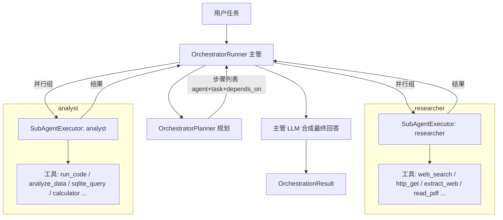

# Stage 12：多 Agent 编排（Manager / Worker）

> 从"一个 agent 会用好工具"到"一个 agent 会组织多个 agent"。
> 本阶段实现 **Manager/Worker 编排模式**：主管（Manager）规划分工、派活、收结果、合成答案；
> 多个专业子 agent（Worker）各司其职，彼此隔离。

## 1. 为什么需要多 Agent？

单 agent 的瓶颈不是"工具不够多"，而是**一个上下文里塞不下多种专业能力**：

| 单 Agent | 多 Agent |
|---|---|
| 检索、分析、写作挤在同一轮对话，上下文互相干扰 | 每个子 agent 只做一件事，上下文干净 |
| 所有工具都对模型可见，选择噪声大 | 按档案白名单隔离工具，模型只看到该用的 |
| 人设单一（"你是全能助手"约等于没有人设） | 每个子 agent 有明确人设与工作规范 |
| 串行执行，长任务总时长 = 各阶段之和 | 无依赖的步骤可并行执行 |

## 2. 架构



### 组件（`app/orchestrator/`）

| 文件 | 职责 |
|---|---|
| `profiles.py` | 子 agent 档案：人设 + 工具白名单（researcher / analyst / writer / generalist） |
| `planner.py` | 编排规划器：LLM 把任务拆成 `SubTask` 列表（agent / task / depends_on） |
| `executor.py` | 子 agent 执行器：独立 ReAct 循环 + 过滤后的工具注册表 + 独立网关 |
| `runner.py` | 编排运行器：依赖图推进、并行限流、失败隔离、最终合成 |
| `tool.py` | `delegate` 工具：主 agent 在对话中直接调用的委派入口 |

## 3. 子 agent 档案（AgentProfile）

专业 = **人设隔离 + 能力隔离** 两个维度：

```python
AgentProfile(
    name="researcher",
    description="信息检索与资料收集：联网搜索、抓取网页、读取 PDF/Excel",
    system_prompt="你是一名资深研究员…只做研究，不做分析计算，也不撰写最终报告。",
    allowed_tools=["web_search", "http_get", "http_get_json", "extract_web",
                   "read_pdf", "read_excel", "get_time", "get_date"],
    max_steps=6,
)
```

关键点：`allowed_tools` 决定子 agent **能看见哪些工具** —— 不是"提示它别用"，而是把
run_code 从 researcher 的工具列表里物理移除。工具权限本身就是边界。

## 4. 编排流程

### 4.1 规划（Planner）

LLM 收到任务 + 可用档案清单，输出严格 JSON：

```json
{
  "rationale": "先查资料，再分析，最后成稿",
  "steps": [
    {"agent": "researcher", "task": "检索 2024 年大模型进展，列出关键论文", "depends_on": []},
    {"agent": "analyst",    "task": "分析检索到的数据趋势",                "depends_on": [0]},
    {"agent": "writer",     "task": "把资料与结论写成报告",                "depends_on": [0, 1]}
  ]
}
```

**防御**（LLM 输出不可信）：
- 容忍 ```json 代码块包裹 / 前后废话（`_extract_json`）
- 未知档案名 → 回退 generalist
- 步骤数上限 `ORCHESTRATOR_MAX_STEPS`，超出的截断
- `depends_on` 只允许引用已出现的步骤下标（`d < i`），天然防环
- 任何解析失败 → 降级为单步 generalist，编排绝不中断

### 4.2 执行（Runner + Executor）

```python
# 按依赖图逐轮推进：每轮取"依赖全部完成"的步骤，并行执行（信号量限流）
while len(done) < len(plan.steps):
    ready = [i for i, step in enumerate(plan.steps)
             if i not in done and all(d in done for d in step.depends_on)]
    await asyncio.gather(*(_run_step(i) for i in ready))  # 并行组
```

每个子 agent 的执行（`SubAgentExecutor.execute`）：

1. **过滤工具**：从主 registry 复制白名单内的工具 → 新 registry + 独立 ToolGateway
   （网关的校验/权限/策略/超时对子 agent 同样生效）
2. **独立上下文**：`[system(人设), user(委派任务 + 依赖步骤结果)]`
3. **独立 ReAct 循环**：`run_react_loop`，`max_steps` 来自档案
4. **不持久化**：子 agent 是"临时工"，不写 Session / Checkpoint / Memory
5. **追踪继承**：`agent.run` span 嵌套在 `orchestrator.run` 下

### 4.3 合成（Synthesis）

- 单步任务 → 直接返回该子 agent 的答案（省一次 LLM 调用）
- 多步任务 → 主管 LLM 把各子 agent 结果整合为最终回答
- LLM 不可用 / 失败 → 拼接兜底（`_join_answers`）

### 4.4 失败语义

| 场景 | 行为 |
|---|---|
| 子 agent 内部异常 | `AgentRunResult.status = FAILED`，其余步骤照常执行 |
| 某步骤失败 | 依赖它的步骤照常跑（context 中标注来源失败） |
| 全部失败 | 整体 `status = FAILED` |
| 部分失败 | 整体 `status = PARTIAL` |
| 依赖环 / 死锁 | 无法推进的步骤标记 `SKIPPED`，不卡死 |

## 5. delegate 工具：主 agent 的委派入口

主 agent 在对话中直接调用 `delegate(task, agents?, context?)`：

```
用户: 调研大模型进展并写报告
主agent: delegate(task="调研 2024 年大模型进展并整理成报告",
                  agents=["researcher", "analyst", "writer"])
        ← 返回 {plan, agent_results, final_answer, status}
主agent: 基于结果给用户最终答复
```

- 对主 agent 来说这是一次普通工具调用；对系统来说这是一次完整的多 agent 编排。
- 子 agent 的注册表**永远排除 delegate** —— 子 agent 不能再往下委派（防递归）。
- `AgentRuntime(orchestrator=runner)` 时自动注册；`ORCHESTRATOR_ENABLED=false` 可关闭。

## 6. Trace 树：编排全透明

```
orchestrator.run (主管)
├── agent.run [researcher]          ← 子 agent 独立循环
│   ├── llm_call
│   └── tool.execute [web_search]
├── agent.run [analyst]
│   ├── llm_call
│   └── tool.execute [run_code]
└── agent.run [writer]
    ├── llm_call
    └── tool.execute [file_write]
```

Web UI 的 Trace 树直接呈现该层级 —— 主管 → 员工 → 工具，每一步的入参/输出/耗时都可展开。

## 7. Web API

```bash
# 直接编排（不经过主 agent）
POST /api/web/orchestrate
{"task": "调研课题", "agents": ["researcher", "analyst"]}
# → {plan, agent_results, final_answer, status, trace_id, trace}

# 子 agent 档案列表
GET /api/web/agents
```

## 8. 配置

```env
ORCHESTRATOR_ENABLED=true        # 编排总开关
ORCHESTRATOR_PLANNER_STRATEGY=llm  # llm(模型分工) | stub(单步兜底)
ORCHESTRATOR_MAX_STEPS=5         # 计划步骤数上限
ORCHESTRATOR_MAX_PARALLEL=3      # 并行子 agent 上限
```

## 9. 运行

```bash
# Demo（真实 LLM 效果最佳；无 Key 降级 stub）
python -m demos.stage12_multiagent_demo

# 测试
pytest tests/test_orchestrator.py -q

# Web UI（聊天中让主 agent 调用 delegate，或直接 POST /api/web/orchestrate）
python -m uvicorn app.main:app --port 8000
```

## 10. 教学点总结

1. **编排与执行的分离**：Planner 只负责"拆"，Executor 只负责"干"，Runner 只负责"调度与合成"。
2. **隔离即安全**：子 agent 的能力边界由工具白名单物理限定，而非提示词自觉。
3. **失败隔离**：一个 worker 挂了不拖垮整个团队 —— 结果结构化、状态可传播。
4. **可观测**：编排天然产生嵌套 span，Trace 树就是团队协作的组织架构图。
5. **递归有界**：delegate 对子 agent 不可见，编排深度恒为 1（后续可扩展多级编排）。
